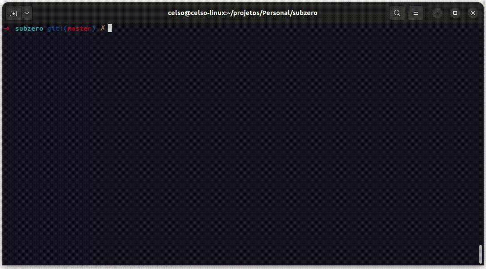

# Subzero CLI
#### Manage and download subtitles easily over your terminal
[](https://github.com/subzero-cli/subzero/actions/workflows/ci.yml)
[](https://goreportcard.com/report/github.com/subzero-cli/subzero)
[](https://github.com/subzero-cli/subzero)
[](https://opensource.org/licenses/MIT)


<div style="text-align: center;">
    
</div>


## Install

```bash
curl -o- https://raw.githubusercontent.com/subzero-cli/subzero/master/install.sh | bash
```
or
```bash
wget -qO- https://raw.githubusercontent.com/subzero-cli/subzero/master/install.sh | bash
```
or check [releases page](https://github.com/subzero-cli/subzero/releases) to install nightly builds

## Using

```
Usage:
  subzero [command]

Available Commands:
  completion  Generate the autocompletion script for the specified shell
  config      Configure your experience using subzero cli
  help        Help about any command
  scan        Scan files for identify movies, series and tvshows
  version     Print the version number of subzero

Flags:
  -h, --help      help for subzero
  -v, --verbose   Enable verbose log

Use "subzero [command] --help" for more information about a command.

```

## Contributing

Send your pull request, guidelines will be appear here soon

